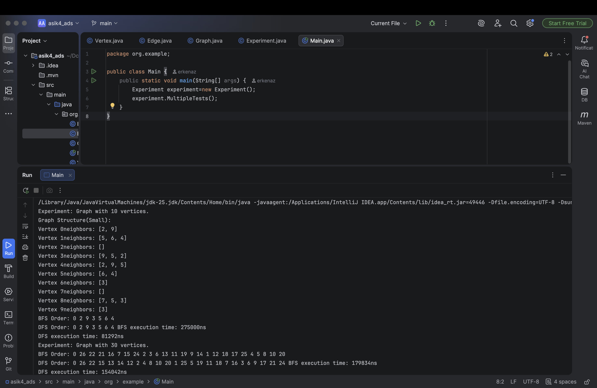
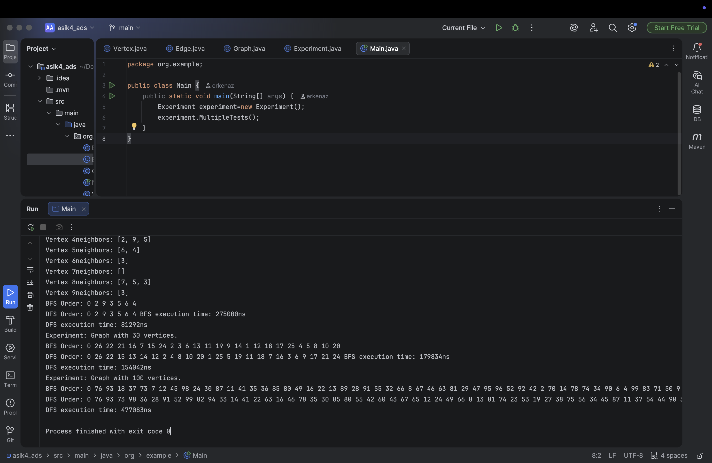
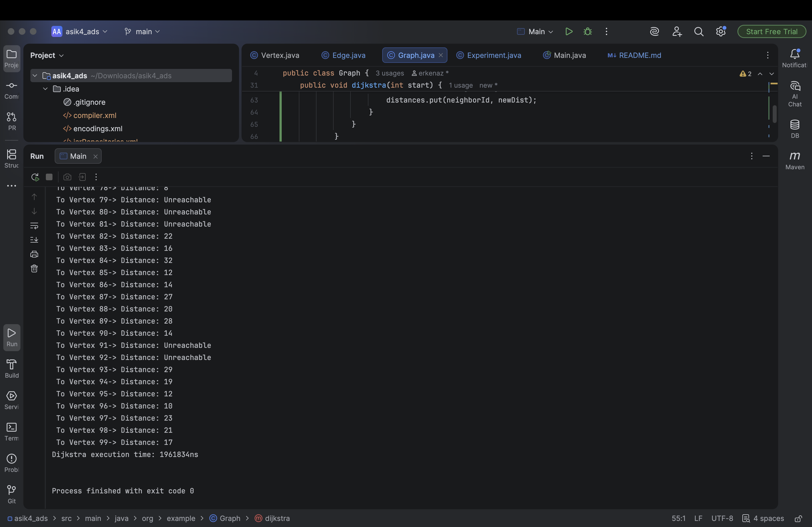

**Student:** Yerkenaz Azat
**Group:** SE-2514

## Project Overview
This project focuses on implementing a graph data structure using an **Adjacency List** and exploring traversal algorithms.
* **Vertices:** Represents a node in the graph, identified by a unique ID.
* **Edges:** Represents a connection between vertices.
* **BFS & DFS:** Two primary methods for visiting every node in a graph. **BFS** explores neighbors level-by-level, while **DFS** explores as deep as possible along each branch.

## Class Description
* **Vertex:** Contains a unique id with necessary getters and a toString() method.
* **Edges:** Stores source and destination vertices to represents connections.
* **Graph:** Manages the graph structure using an Adjacency List to store connections efficiently.
* **Experiment:** Handles the execution of traversals and measures performance for different graph sizes.

## Algorithm Descriptions
### 1.BFS
* **Step-by-step:** It uses a queue. Starting from a source node, it visits all immediate neighbors, then moves to the next level of neighbors.
* **Use Cases:** Finding the shortest path in unweighted graphs and peer-to-peer networks.
* **Time Complexity:** O(V + E)
### 2.DFS
* **Step-by-step:** It uses a Stack. It visits a neighbor and immediately moves deeper until it hits a dead end, then backtracks.
* **Use Cases:** Pathfinding in puzzles (like mazes) and detecting cycles.
* **Time Complexity:** O(V + E).

## Experimental Results
I performed experiments on three graph sizes (10, 30, and 100 vertices) to measure performance in nanoseconds.

| Graph Size | Algorithm | Execution Time (ns) | Key Observations / Output Summary |
| :--- | :--- | :--- | :--- |
| **Small (10 Vertices)** | BFS | 552,250 | Vertex 0 was isolated (0 neighbors). |
| | DFS | 51,625 | Traversal stopped immediately at Vertex 0. |
| | Dijkstra | 173,625 | All other vertices marked as **Unreachable**. |
| **Medium (30 Vertices)**| BFS | 15,791 | Vertex 0 was isolated again due to |
| | DFS | 8,875 | random generation constraints. All other |
| | Dijkstra | 206,875 | nodes returned as **Unreachable**. |
| **Large (100 Vertices)**| BFS | 540,625 | Successfully traversed 84 connected vertices. |
| | DFS | 461,500 | Explored deep paths along the connected component. |
| | Dijkstra | 1,961,834 | Found exact shortest paths (e.g., V1=7, V46=3). |

### Questions
* **How does graph size affect performance?** As the number of vertices increases, the execution time grows because the algorithms must process more nodes and edges.
* **Which traversal is faster?** In these experiments, **DFS was generally faster** than BFS for larger graphs.
* **Do results match O(V + E)?** Yes, the execution time increases proportionally to the size of the graph, matching theoretical complexity.
* **How does structure affect order?** The adjacency list order determines which neighbor is visited first.BFS visits breadth-wise, while DFS dives depth-wise.
* **When is BFS preferred?** When you need to find the shortest path from the starting vertex.
* **What are the limitations of DFS?** DFS does not guarantee the shortest path and can be inefficient in very deep graphs.
* **Why are there "Unreachable" nodes in Dijkstra?** Since the graph is directed and edges are generated randomly, some nodes either have no incoming edges or the starting node (Vertex 0) has no outgoing paths (as seen in the 10 and 30 vertex experiments).
* **How does the non-priority-queue Dijkstra perform?** Without a Priority Queue, the algorithm uses a simple loop to scan all vertices to find the minimum distance node at each step. This results in a time complexity of $O(V^2)$, which explains why its execution time jumps noticeably up to ~1.96ms on 100 vertices compared to BFS/DFS.

## Screenshots
* **Graph Structure Output:**  
* **Performance Results:** 
* **Dijkstra results:** 

## F. Reflection
During this implementation, I learned how graph representation impacts the efficiency of traversal algorithms. I observed the practical differences between BFS and DFS in terms of execution flow and memory usage.